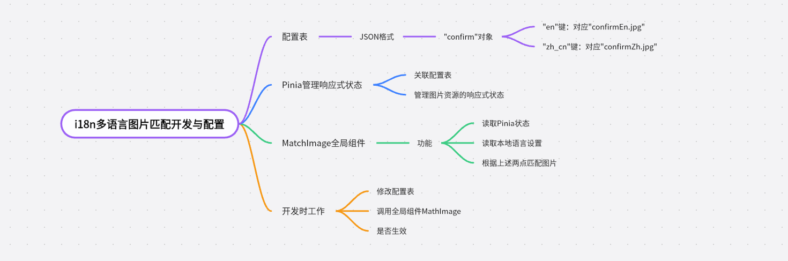

# i18n多语言图片匹配开发与配置


## 思维导图(去掉pinia管理)



## 配置表（开发/配置）i18Image.json
```json

{
  "register": {
    "en": "/public/i18Image/en/btnv2_reg_enable.png",
    "bn": "/public/i18Image/bn/btnv2_reg_enable.png"
  }
}

```

## 封装一个MatchImage全局组件（配置）
``` ts
<template>
  
</template>

<script lang="ts">
import { defineComponent, computed } from "vue";
import { useI18n } from "vue-i18n";
import i18Image from "@/locales/i18Image.json"; // 确保路径正确

export default defineComponent({
  props: {
    imageKey: {
      type: String,
      required: true,
    },
  },
  setup(props) {
    const i18n = useI18n();
    const imageSrc = computed(() => {
      const images = i18Image[props.imageKey];
      if (images) {
        return images[i18n.locale.value] || images["en"]; // 默认使用英文图片
      }

      console.error("NOTE: Language pictures not found");
      return null;
    });

    return {
      imageSrc,
    };
  },
});
</script>

// <!-- <MatchImage image-key="register" class="loginRegister" /> -->

```

## 后续开发 

1. 配置表 i18Image.json
2. MatchImage 调用
``` js
<MatchImage image-key="register" />
```

