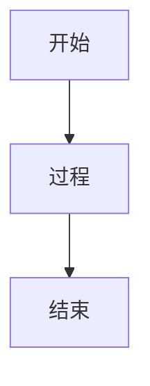
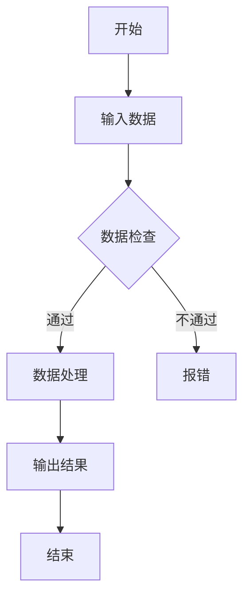

## 定义方向

graph TD   # 自上而下（Top-Down）
graph LR   # 从左到右（Left-Right）
graph RL   # 从右到左
graph BT   # 自下而上

## 定义形状 
graph TD
    A[方形节点]
    B(圆角节点)
    C{菱形条件节点}
    D((圆形节点))

## 连接节点

graph TD
    A --> B          # 实线箭头
    A -- 描述文字 --- B  # 带文字的实线
    A -->|描述文字| B  # 另一种写法
    A -.-> B         # 虚线箭头

## 样式自定义 

graph TD
    A[红色节点]:::redClass
    classDef redClass fill:#f00,color:#fff;


## 高效学习资源

官方文档
Mermaid 官网：https://mermaid.js.org

最权威的语法指南和示例。

交互式练习
Mermaid Live Editor：https://mermaid.live

在线实时编辑和预览流程图。

中文教程
Mermaid 快速入门：https://zhuanlan.zhihu.com/p/355997933

流程图进阶技巧：https://juejin.cn/post/7067319689953509384    

## 示例模板 



## 相关问题 

1. 如何导出图片 
使用 [Mermaid Live Editor](https://mermaid.live/) 在线复制代码并导出为 PNG/SVG。

安装插件 [Markdown PDF](https://marketplace.visualstudio.com/items?itemName=yzane.markdown-pdf)，将 Markdown 导出为 PDF 或图片。

2. 流程图预览不显示？
检查插件是否安装并启用。

确保代码块标记为 ```mermaid。

尝试使用 Markdown Preview Enhanced 插件增强渲染。