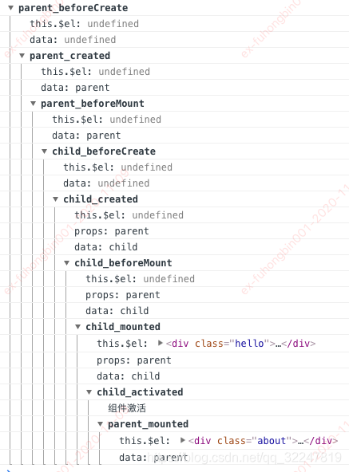
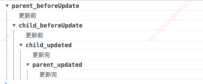

## 父子组件嵌套渲染其生命周期&路由守卫 
1. 创建过程
   
    <!--  -->
2. 更新过程
   
   <!--  -->
3. 销毁过程
   
   <!--  -->

## vue2 vue3 的父子传值 

1. **vue2父传子：通过 props 传递数据。父组件在子组件标签上绑定属性，子组件通过 props 选项接收。**
``` js
   //  父组件
   <Child :message="parentMsg" />

   // 子组件
   <script>
      export default {
      props: ['message']
      }
   </script>
```

2. **vue2子传父：子组件通过 $emit 触发自定义事件，父组件监听事件并处理。**
``` js
// <!-- 子组件 -->
<button @click="$emit('send', data)">提交</button>

// <!-- 父组件 -->
<Child @send="handleData" />
```

3. **父传子：与 Vue2 类似，但需在 setup 中显式声明 props：**
```js
// <!-- 子组件 -->
<script setup>
   const props = defineProps(['message']);
</script>
```

4. **子传父：使用 defineEmits 定义事件，通过 emit 触发：**
```js
// <!-- 子组件 -->
<script setup>
const emit = defineEmits(['send']);
emit('send', data);
</script>

// <!-- 父组件 -->
<Child @send="handleData" />

```

**区别**
``` js
   Vue3 支持 <script setup> 语法糖，简化了 props 和 emit 的定义。
   Vue3 的 v-model 可以绑定多个值（如 v-model:title），替代 Vue2 的 .sync 修饰符。
```

## vue2 vue3 的生命周期 

1. vue2常用
   ``` js
      beforeCreate → created → beforeMount → mounted

      beforeUpdate → updated

      beforeDestroy → destroyed
   ```
2. vue3常用
```js
// Composition API 中钩子以 on 开头，需在 setup 中使用：
import { onMounted } from 'vue';
setup() {
  onMounted(() => { /* ... */ });
}

变化：
beforeCreate 和 created 被 setup 替代。

beforeDestroy → onBeforeUnmount，destroyed → onUnmounted
```

## react16 react18 的父子传值
**父子传值方式（React16/18 一致）**
``` js
// 父组件
<Child message={parentMsg} />

// 子组件
function Child({ message }) {
  return <div>{message}</div>;
}
```

**子传父：父组件传递回调函数，子组件调用并传参。**
```js
// 父组件
<Child onSubmit={handleData} />

// 子组件
function Child({ onSubmit }) {
  return <button onClick={() => onSubmit(data)}>提交</button>;
}
```

## react16 react18 的生命周期

1. **React16（类组件）生命周期**
```js
挂载阶段：

   constructor → static getDerivedStateFromProps → render → componentDidMount

更新阶段：

   static getDerivedStateFromProps → shouldComponentUpdate → render → getSnapshotBeforeUpdate → componentDidUpdate

卸载阶段：

   componentWillUnmount
```

2. React18 （函数组件）生命周期 
类组件生命周期与 React16 一致，但废弃了以下方法：
componentWillMount、componentWillReceiveProps、componentWillUpdate（需加 UNSAFE_ 前缀）

函数组件：使用 Hooks 替代生命周期：

useEffect(() => {
  // componentDidMount + componentDidUpdate
  return () => { /* componentWillUnmount */ };
}, [deps]);

**对比：**

类组件生命周期	函数组件 Hooks 替代
componentDidMount	useEffect(() => {}, [])
componentDidUpdate	useEffect(() => {}, [deps])
componentWillUnmount	useEffect(() => { return cleanup })
shouldComponentUpdate	React.memo 或 useMemo